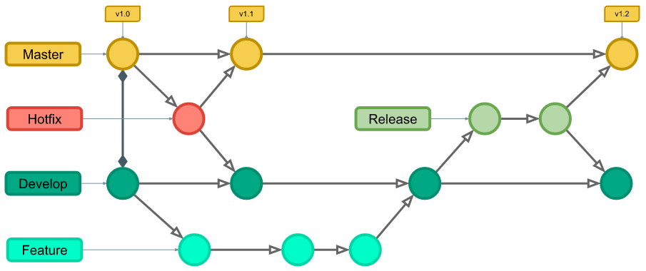

# git_flow

- 프로젝트에서 릴리즈 전 세분화한 브랜치 관리 전략

## branch 종류

- 메인 브랜치
  - master : 작업 완류 후 배포하는 브랜치
  - develop : 개발자들이 실제 개발을 할 때 사용하는 브랜치
    

- 보조 브랜치
  - feature : 특정 기능을 개발하기 위해 사용되는 브랜치

    완성시 develop에 merge   

  - release : 배포 할때 생성되는 브랜치

    배포시에는 master로 merge

    배포버전을 찾기 쉽게 merge되는 커밋을 태그하고 devlop에도 merge
  - hotfix : 긴급수정 브랜치로 계획되지않은 배포를 위한 브랜치

    치명적 오류를 즉시 해결하기 위해 master에서 hotfix 생성

